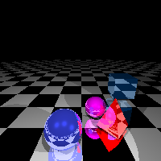
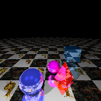
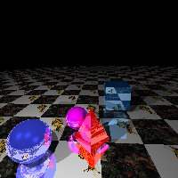
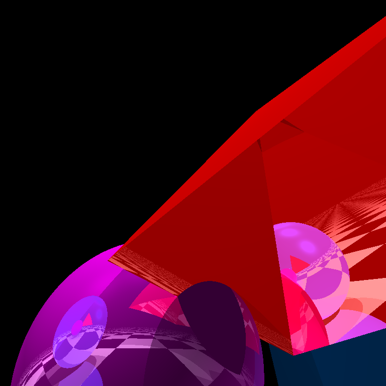

# Ray Tracer

## Usage
For Windows Only
- Install OpenGL in your PC and write `run.bat 1805093_main`
- Otherwise run the `.exe` file

## Features
- [x] Sphere
- [x] Triangle
- [x] Rectangle
- [x] Cube
- [x] Pyramid

## Controls
- `W` - Camera Up
- `S` - Camera Down
- `A` - Camera Left
- `D` - Camera Right
- `1` - Camera Left
- `2` - Camera Right
- `3` - Camera Up
- `4` - Camera Down
- `5` - Camera Tilts Left
- `6` - Camera Tilts Right
- `Page Up` - Move Up
- `Page Down` - Move Down
- `Up Arrow` - Move Forward
- `Down Arrow` - Move Backward
- `0` - Capture Screenshot
- `SPACE` - Texture Mode On/Off
- `ESC` - Exit

## Screenshots

## Notes
- Floor is not infinite
- Reflection of any level works perfectly (except for pyramid's base)
- Texture works great. I have commented out the part where texture needs to get multiplied with floor color as that becomes too dark
- The video generated here is not good. But you can take the code, it works

## Further Improvements
- Floor can be made infinite
- Pyramid's base is not properly reflected
